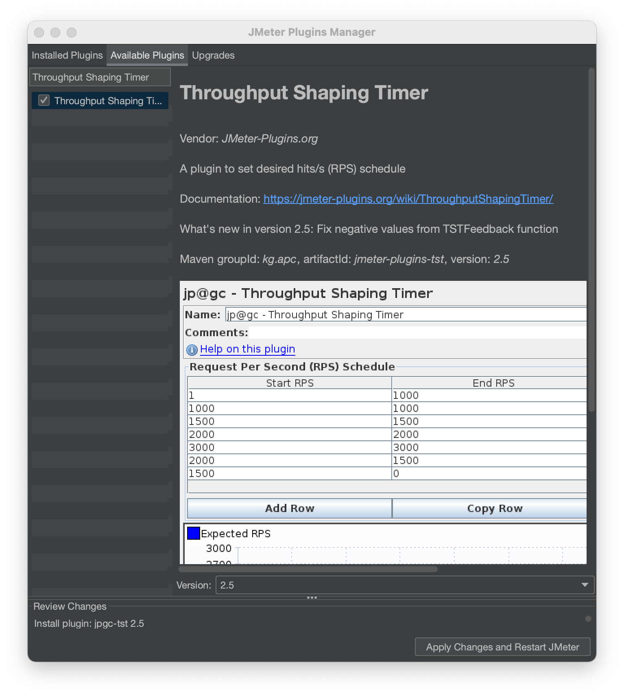

# sample-load-test-apache-jmeter

A sample project to demonstrate load testing a python flask web application
with [Apache JMeter](https://jmeter.apache.org/index.html).

## Quick Start

To get started, simply:

1) In your terminal, clone this repository, and run the sample server
   ```shell
    git clone git@github.com:ChrisCarini/sample-load-test-apache-jmeter.git
    cd sample-load-test-apache-jmeter
    source setup.sh
    gunicorn -w 8 -b 127.0.0.1:5000 "webapp:create_app()" --access-logfile -
    ```
1) Download Apache JMeter (_as of publishing, version 5.4.1 is the latest - this sample assumes you are using that
   version._)
    - **Note:** If you use `brew` on macOS, you can install via `brew install jmeter`.

1) Start JMeter in your terminal: `jmeter` _(This should launch the Apache JMeter GUI.)_

1) Install the [`Throughput Shaping Timer`](https://jmeter-plugins.org/wiki/ThroughputShapingTimer/)
   a) In Apache JMeter, select `Options`, then `Plugin Manager`
   a) Click on `Available Plugins`, then search for `Throughput Shaping Timer`. Select it (click the checkbox), and
   Click `Apply Changes and Restart JMeter`.
   

1) In Apache JMeter, open the `test_fast_endpoint.jmx` file. Make the needed configuration changes - see the "
   configuration tips" section below.

## Configuration Tips

* Read ["How Many Threads I Need To Produce Desired RPS?"][1]; configure the threads accordingly.
* Change the protocol, domain/IP, port number under the `HTTP Request Defaults` config element.
* Change the HTTP Request type and Path under the `HTTP GET /fast` config element.
* Change the HTTP headers under the `HTTP Header Manager` config element.
* Change the desired QPS / RPS under the `Throughput Shaping Timer` config element.

## References

### Apache JMeter

* [Apache JMeter](https://jmeter.apache.org/index.html)
* [Apache JMeter - Download](https://jmeter.apache.org/download_jmeter.cgi)
* [Apache JMeter - Throughput Shaping Timer](https://jmeter-plugins.org/wiki/ThroughputShapingTimer/) _(plugin used for
  scaling throughput tests)_
    - **NOTE:** This page has information on calculating ["How Many Threads I Need To Produce Desired RPS?"][1]. I
      recommend reading this to identify how many threads you should configure!

[1]: https://jmeter-plugins.org/wiki/ThroughputShapingTimer/#How-Many-Threads-I-Need-To-Produce-Desired-RPS